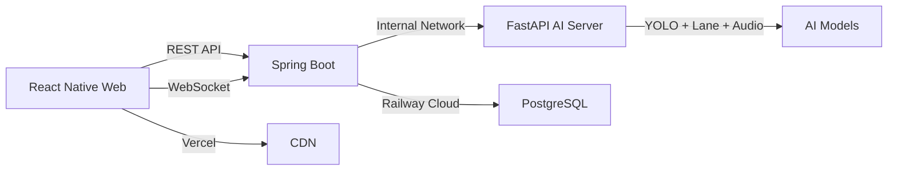
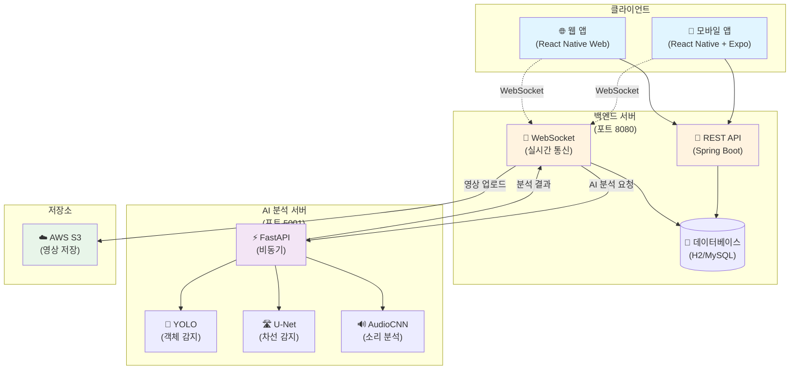
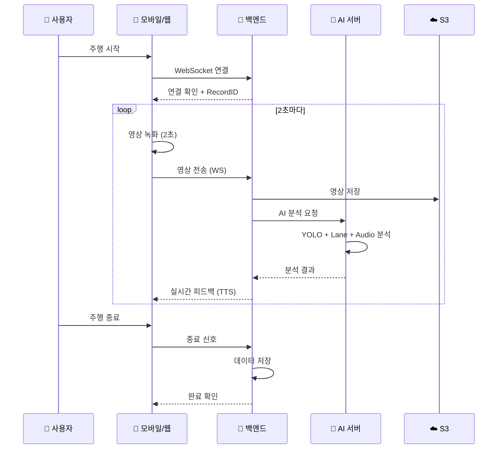
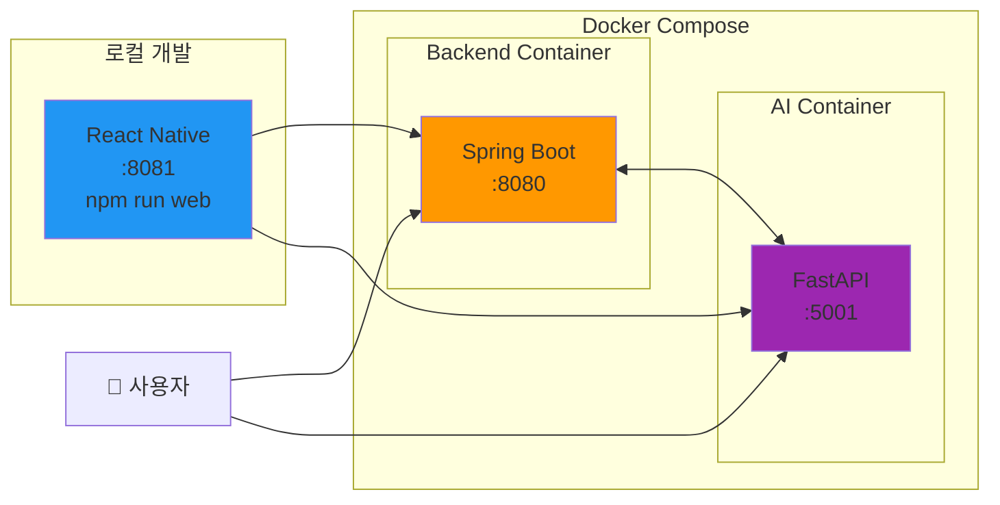

# 🚗 DrivingCoach - AI 운전 코칭 시스템

> **졸업 과제 프로젝트** | AI로 운전 습관을 분석하고 피드백을 제공하는 시스템

[](https://github.com/junwest/DrivingCoach)

---

## 👨‍💻 프로젝트 기여도 및 역할

> [!IMPORTANT]
> **총괄 및 MLOps/AI 리드** - 시스템 아키텍처 설계부터 배포 자동화까지 전 과정 주도

### 🎯 핵심 기여 영역

<table>
<tr>
<td width="50%">

#### 🤖 **AI 모델 개발**
- ✅ YOLO 객체 탐지 모델 학습
- ✅ Lane Detection 차선 인식
- ✅ AudioCNN 주행음 분석
- ✅ FastAPI 멀티모달 추론 서버

</td>
<td width="50%">

#### 🚀 **MLOps & 인프라**
- ✅ Docker Compose 오케스트레이션
- ✅ Railway 클라우드 배포
- ✅ ngrok 하이브리드 아키텍처
- ✅ CI/CD 파이프라인 구축

</td>
</tr>
<tr>
<td>

#### ⚙️ **시스템 통합**
- ✅ 3-tier 아키텍처 설계
- ✅ WebSocket 실시간 통신
- ✅ CORS/Mixed-Content 해결
- ✅ 환경별 설정 자동화

</td>
<td>

#### 💻 **웹 플랫폼 개발**
- ✅ React Native Web 포팅
- ✅ Vercel 서버리스 배포
- ✅ 반응형 UI/UX 구현
- ✅ 브라우저 호환성 최적화

</td>
</tr>
</table>

### 📊 기술 스택 개요



### 📦 프로젝트 구조
```
DrivingCoach/
├── 🧠 model/              # AI 서버 (FastAPI) - 본인 개발
│   ├── models/            # YOLO, Lane, AudioCNN
│   ├── src/               # 추론 서버 로직
│   └── Dockerfile         # AI 서버 컨테이너화
├── 🔧 dev/                # 백엔드 (Spring Boot)
├── 📱 front/              # 프론트엔드 (React Native)
└── 🐳 docker-compose.yml  # 멀티 컨테이너 오케스트레이션
```


## 🌐 라이브 데모 사이트

**✨ 지금 바로 체험해보세요!**

- **데모 URL**: https://c5666e306007.ngrok-free.app
- **로그인 정보**:
  - 아이디: `1234`
  - 비밀번호: `12345678`

> **📱 배포 방식 안내**  
> 본 앱은 원래 **Android 에뮬레이터**에서 실행되도록 개발되었으나, 실제 주행 영상 촬영이 불가능하여 **웹 버전으로 배포**하였습니다. 주행 중 실시간 AI 판별 등 자세한 기능은 **발표 영상** 및 **보고서**를 참고해주시기 바랍니다.

> **⚠️ 중요**: 이 데모 사이트는 개발자의 노트북이 켜져있을 때만 작동합니다.

---

## 📺 바로 보기

아래 3단계만 따라하면 프로젝트를 바로 실행할 수 있습니다!

### ⚡ 빠른 시작 (3단계)

#### 1단계: Docker Desktop 설치 (5분 소요)

**Docker가 뭔가요?** 
- 프로그램을 자동으로 실행해주는 도구입니다
- Java, Python 등을 하나하나 설치할 필요가 없습니다

**설치 방법:**
1. https://www.docker.com/products/docker-desktop 접속
2. 본인 컴퓨터에 맞는 버전 다운로드
   - Windows: "Download for Windows" 클릭
   - Mac (M1/M2): "Download for Mac with Apple silicon" 클릭
   - Mac (Intel): "Download for Mac with Intel chip" 클릭
3. 다운로드된 파일 실행하고 설치
4. **Docker Desktop 앱을 실행** (아주 중요!)
   - 맥: 런치패드 → Docker 아이콘
   - 윈도우: 시작 메뉴 → Docker Desktop

✅ Docker Desktop 앱이 열리면 준비 완료!

---

#### 2단계: 프로젝트 다운로드 (1분 소요)

**방법 A: ZIP 다운로드 (추천 - 더 쉬움)**
1. 이 페이지 위쪽 초록색 "Code" 버튼 클릭
2. "Download ZIP" 클릭
3. 다운로드된 ZIP 파일 압축 해제
4. 압축 푼 폴더 열기

**방법 B: Git 사용 (Git이 설치되어 있다면)**
```bash
git clone https://github.com/junwest/DrivingCoach.git
cd DrivingCoach
```

---

#### 3단계: 실행하기 (30초 소요)

압축 푼 폴더에서:

**Windows 사용자:**
1. `run_all.bat` 파일 찾기
2. **더블 클릭** (그게 전부입니다!)

**Mac 사용자:**
1. 터미널 열기 (Cmd + Space → "터미널" 검색)
2. 다음 명령어 입력:
```bash
cd DrivingCoach폴더경로  # 폴더를 터미널에 드래그하면 경로가 자동입력됩니다
./run_all.sh
```

---

### 🎉 실행 완료!

서버가 시작되면 브라우저를 열고 이 주소들로 접속하세요:

| 무엇을 볼까요? | 주소 | 설명 |
|---|---|---|
| 🌐 **앱 화면 (로컬)** | http://localhost:8081 | 실제 애플리케이션 (웹 버전) |
| 🚀 **앱 화면 (배포)** | [Vercel 배포 가이드](DEPLOYMENT.md) | 인터넷 URL로 접근 가능 |
| 📚 AI API 문서 | http://localhost:5001/docs | AI 분석 기능 테스트 |
| 📊 백엔드 API | http://localhost:8080/swagger-ui/index.html | 서버 API 테스트 |

> **처음이신가요?** 먼저 http://localhost:8081 로 접속해서 앱을 확인해보세요!
> 
> **외부에서 접속하려면?** [Vercel 배포 가이드](DEPLOYMENT.md)를 참고하세요.

---

## 🤔 문제가 생겼나요?

### "Docker가 실행되지 않습니다"
→ Docker Desktop 앱이 실행 중인지 확인하세요 (상단 메뉴바나 시스템 트레이에 고래 아이콘이 보여야 함)

### "포트가 이미 사용 중입니다"
→ 터미널에서 실행:
```bash
docker-compose down
```
그리고 다시 `run_all.bat` 또는 `run_all.sh` 실행

### "주소에 접속이 안 돼요"
→ 서버가 시작되는 데 1-2분 정도 걸릴 수 있습니다. 조금 기다린 후 새로고침하세요.

### 그래도 안 되나요?
→ GitHub Issues에 질문을 남겨주세요: https://github.com/junwest/DrivingCoach/issues

---

## 📱 모바일 앱도 실행하고 싶다면?

### 준비물
- 스마트폰
- Expo Go 앱 설치
  - [iOS App Store](https://apps.apple.com/app/expo-go/id982107779)
  - [Google Play](https://play.google.com/store/apps/details?id=host.exp.exponent)

### 실행 방법
1. 터미널에서:
```bash
cd front
npm install
npm start
```

2. QR 코드가 나타나면 Expo Go 앱으로 스캔

---

## 🎯 프로젝트 소개

### 이게 무엇인가요?

DrivingCoach는 **AI를 이용해 운전 습관을 분석**하는 시스템입니다.

**주요 기능:**
- 🎥 블랙박스 영상 분석 (YOLO AI 사용)
- 🛣️ 차선 변경 감지 (딥러닝)
- 🔊 소리 분석 (경적, 깜박이, 와이퍼)
- ⚠️ 위험 운전 자동 감지 (11가지 시나리오)
- 📱 모바일 앱으로 기록 확인

### 어떤 위험 운전을 감지하나요?

| 번호 | 감지 내용 |
|---|---|
| 4 | 차선 변경 후 깜박이를 끄지 않음 |
| 5 | 깜박이 없이 차선 변경 |
| 7 | 비 오는데 전조등 미점등 |
| 8 | 우회전 시 불필요한 경적 |
| 9 | 보행자 근처에서 경적 |
| 10 | 급정거 중 경적 (위협 운전) |
| 11 | 비상등 남용 |

---

## 🏗️ 시스템 아키텍처

### 전체 구조



### 데이터 흐름



### 배포 아키텍처



### 기술 스택 상세

| 계층 | 기술 | 역할 |
|---|---|---|
| **프론트엔드** | React Native + Expo | 크로스 플랫폼 모바일/웹 앱 |
| **백엔드** | Spring Boot 3.3 + JWT | RESTful API, 인증, WebSocket |
| **AI 서버** | FastAPI + Uvicorn | 비동기 AI 모델 서빙 |
| **AI 모델** | YOLO v8, U-Net, CNN | 객체/차선/소리 분석 |
| **데이터베이스** | H2 (개발), MySQL (프로덕션) | 사용자 및 주행 기록 |
| **스토리지** | AWS S3 | 영상 파일 저장 |
| **배포** | Docker + Docker Compose | 컨테이너 오케스트레이션 |

---

## 💻 기술 스택 (참고용)

궁금하신 분들을 위해:

- **AI/ML**: PyTorch, YOLO, U-Net, CNN
- **백엔드**: Spring Boot, FastAPI
- **프론트엔드**: React Native (Expo)
- **데이터베이스**: MySQL / H2
- **배포**: Docker, Docker Compose

---

## 📂 프로젝트 구조

```
DrivingCoach/
├── 🐳 run_all.bat        # Windows에서 더블클릭하면 실행
├── 🐳 run_all.sh          # Mac/Linux 실행 스크립트
├── 📖 README.md           # 이 파일
├── 📖 DOCKER_GUIDE.md     # Docker 상세 가이드
│
├── dev/                   # 백엔드 (Spring Boot)
├── model/                 # AI 서버 (FastAPI)
└── front/                 # 모바일/웹 앱 (React Native)
```

---

## 🔧 서버 제어 명령어

### 서버 중지
```bash
docker-compose down
```

### 서버 재시작
```bash
docker-compose restart
```

### 로그 확인
```bash
docker-compose logs -f
```

### 완전히 처음부터 다시
```bash
docker-compose down -v
docker-compose up --build
```

---

## 📚 더 자세한 가이드

각 폴더별로 상세한 README가 있습니다:

- [Docker 상세 가이드](DOCKER_GUIDE.md) - Docker 사용법
- [백엔드 가이드](dev/README.md) - Spring Boot 서버
- [AI 서버 가이드](model/README.md) - FastAPI 서버
- [프론트엔드 가이드](front/README.md) - React Native 앱
- [AI 모델 설치 가이드](model/SETUP_GUIDE.md) - 수동 설치 방법

---

## 🎓 교수님/평가자를 위한 가이드

### 빠른 데모 확인
1. Docker Desktop 실행
2. `run_all.bat` (Windows) 또는 `./run_all.sh` (Mac) 실행
3. http://localhost:8081 접속 → 앱 확인
4. http://localhost:5001/docs 접속 → AI API 테스트

### 예상 소요 시간
- Docker 설치: 5분
- 첫 실행 (이미지 빌드): 5-10분
- 이후 실행: 30초

### 시스템 요구사항
- **OS**: Windows 10+, macOS 10.15+, Linux
- **메모리**: 최소 4GB RAM (권장 8GB)
- **디스크**: 약 5GB 여유 공간
- **Docker Desktop**: 최신 버전

---

## 🏆 프로젝트 성과

- ✅ AI 기반 실시간 운전 분석
- ✅ 11가지 위험 운전 시나리오 자동 감지
- ✅ 풀스택 모바일 애플리케이션
- ✅ Docker를 통한 원클릭 배포
- ✅ 완벽한 문서화

---

## 👥 프로젝트 기여 및 역할 분담

> [!NOTE]
> **DrivingCoach 프로젝트 기여 및 역할 분담 보고서 (Final Version)**

### 🔑 팀 구성 및 역할 요약

| 👤 팀원 | 🎯 핵심 역할 | 📌 주요 담당 |
|---------|-------------|------------|
| **본인** | 총괄 및 MLOps/AI 리드 | PM, 시스템 아키텍처, MLOps, AI 모델, Web 개발, UI/UX |
| **cksdid202** | 백엔드 개발 | REST API, 비즈니스 로직, WebSocket |
| **janghosung01** | 모바일 앱 개발 | React Native, 디바이스 연동 |

---

### 1️⃣ 총괄 및 MLOps/AI 리드 (본인)

#### 🎨 UI/UX 디자인 (Generative AI 활용)
개발 착수 전, 생성형 AI를 활용하여 사용자 중심의 디자인 시스템을 구축하고 개발 시간을 단축했습니다.

- **Readdy AI 기반 프로토타이핑**: Readdy AI 플랫폼을 적극 활용하여 사용자 경험(UX) 중심의 인터페이스를 직접 기획하고, 고품질의 디자인 프로토타입을 신속하게 제작하여 전체 개발 효율성을 극대화함.

#### 🚀 MLOps 및 클라우드 인프라 (Core Contribution)
단순한 배포를 넘어, 서비스의 안정성과 확장성을 보장하는 엔터프라이즈급 인프라 아키텍처를 설계하고 구축했습니다.

- **하이브리드 네트워크 터널링 구축**: 로컬 개발 환경의 한계를 극복하기 위해 ngrok을 활용한 하이브리드 네트워크를 구성하고, 외부 접근을 위한 리버스 프록시 및 보안 터널링을 최적화함.
- **컨테이너 오케스트레이션**: Docker 및 Docker Compose를 기반으로 AI(FastAPI), Backend(Spring Boot), Frontend 컨테이너 간의 의존성을 관리하고, 'One-Click' 배포 환경을 구현함.
- **Low-Latency 아키텍처 설계**: 실시간 위험 감지를 위해 Client ↔ Backend ↔ AI Server 간 통신 경로를 최적화함. Docker 내부 네트워크(Internal Network)를 활용하여 추론 레이턴시를 최소화하고, 외부 접속 시 WSS(Secure WebSocket) 프로토콜을 적용하여 보안성을 확보함.

#### 💻 웹(Web) 애플리케이션 개발 (단독 수행)

- **Web 클라이언트 개발**: React Native Web 기술을 도입하여 기존 모바일 중심 코드를 웹 환경으로 포팅하고, 브라우저 환경에 맞는 UI/UX 최적화를 수행하여 웹 버전을 단독으로 개발함.
- **CI/CD 및 Vercel 배포**: Vercel을 이용한 서버리스 배포 파이프라인을 구축하고, 환경 변수 자동화 관리를 통해 개발(Dev)과 운영(Prod) 환경을 분리하여 운영함.

#### 🛠 시스템 통합 및 문제 해결 (Troubleshooting)

- **Mixed-Content 및 보안 이슈 해결**: HTTPS 환경에서 HTTP 백엔드 호출 시 발생하는 차단 문제를 해결하기 위해, 5개 핵심 컴포넌트(Login, Signup, Home, MyPage, Record)의 하드코딩된 URL을 Railway HTTPS URL로 전면 리팩토링함.
- **환경 설정 자동화**: config.js를 통해 실행 환경(Local/EC2/Railway)을 자동 감지하여 API 엔드포인트를 동적으로 스위칭하는 시스템을 구축함.

#### 🤖 AI 모델링 및 서빙

- **멀티 모달 AI 개발**: 주행 영상 분석용 YOLO(객체), Lane Detection(차선) 모델과 소리 분석용 AudioCNN 모델을 직접 학습 및 개발함.
- **비동기 추론 서버**: FastAPI 기반의 비동기 AI 서버를 구축하여 복수 모델의 병렬 추론 시스템을 구현함.

---

### 2️⃣ 백엔드 개발 (cksdid202)

**핵심 역할**: 서버 비즈니스 로직 구현, REST API 설계, WebSocket 메시징 처리

- **RESTful API 구현**: Spring Boot를 사용하여 회원가입, 주행 기록 저장/조회 등 서비스의 핵심 비즈니스 로직 API를 구현함.
- **WebSocket 핸들러 구현**: 구축된 인프라 위에서 클라이언트와 서버 간의 실시간 데이터를 중계하는 WebSocket Handler 및 세션 관리 로직을 개발함.

---

### 3️⃣ 모바일 앱 개발 (janghosung01)

**핵심 역할**: 모바일 클라이언트(Android/iOS) 구현, 디바이스 기능 연동

- **모바일 앱(App) 구현**: React Native를 사용하여 안드로이드 및 iOS 환경에서 동작하는 네이티브 앱 클라이언트를 전담 개발함.
- **디바이스 제어**: 모바일 기기의 카메라 및 센서 제어 기능을 구현하고, 백엔드 API와 연동하여 실제 주행 환경에서의 앱 사용성을 확보함.


---

## 📄 라이선스

이 프로젝트는 교육 목적으로 제작되었습니다.

---

## 💬 질문이 있으신가요?

- 🐛 버그 제보: [GitHub Issues](https://github.com/junwest/DrivingCoach/issues)
- 💡 기능 제안: [GitHub Issues](https://github.com/junwest/DrivingCoach/issues)
- 📧 문의: GitHub Issues를 이용해주세요

---

<div align="center">

**⭐ 이 프로젝트가 도움이 되셨다면 Star를 눌러주세요! ⭐**

Made with ❤️ by DrivingCoach Team

</div>
